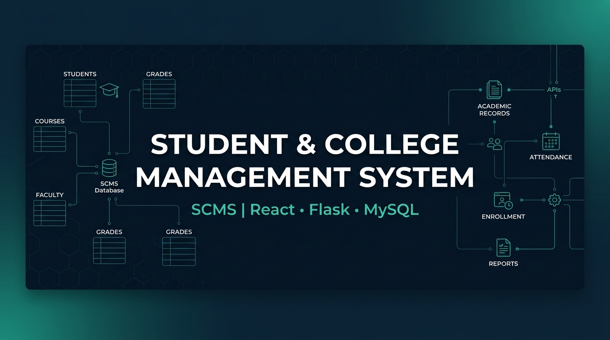
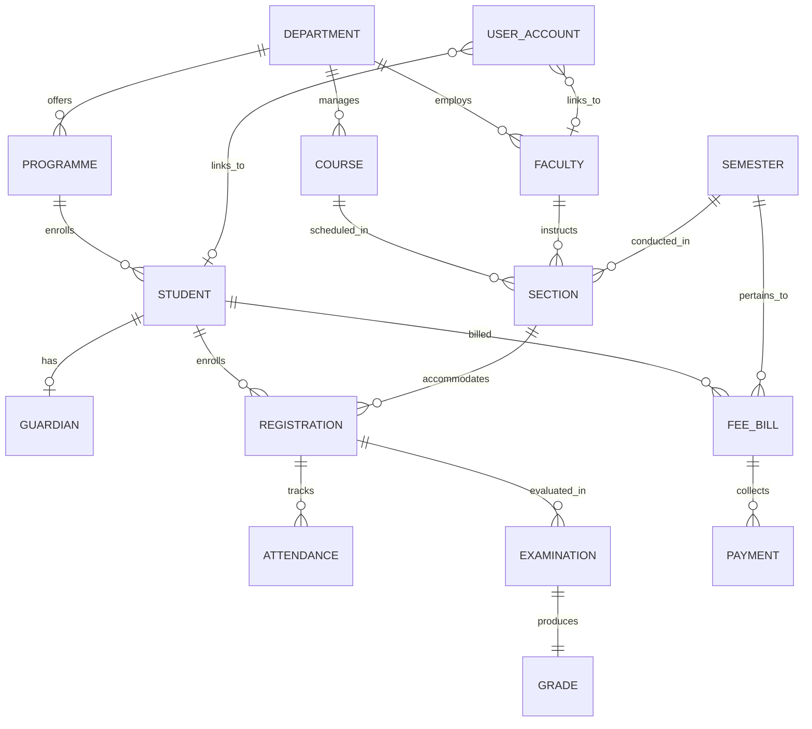
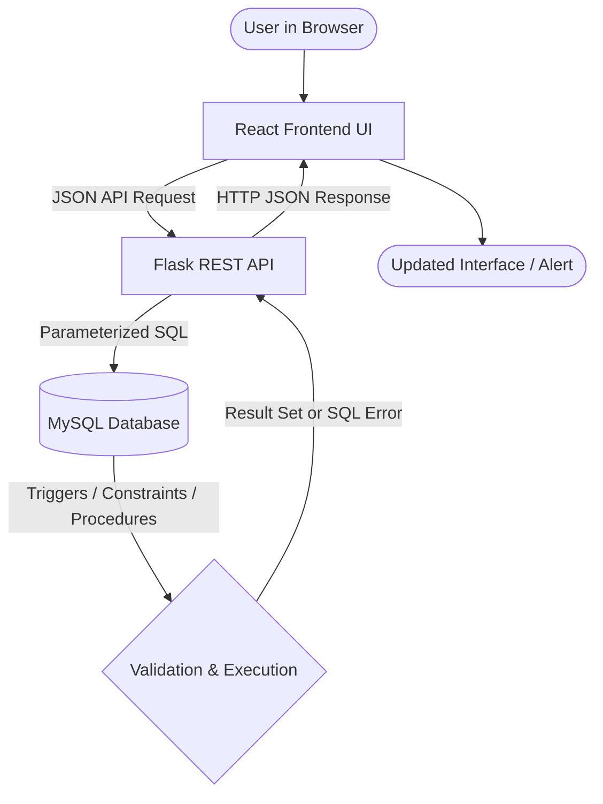
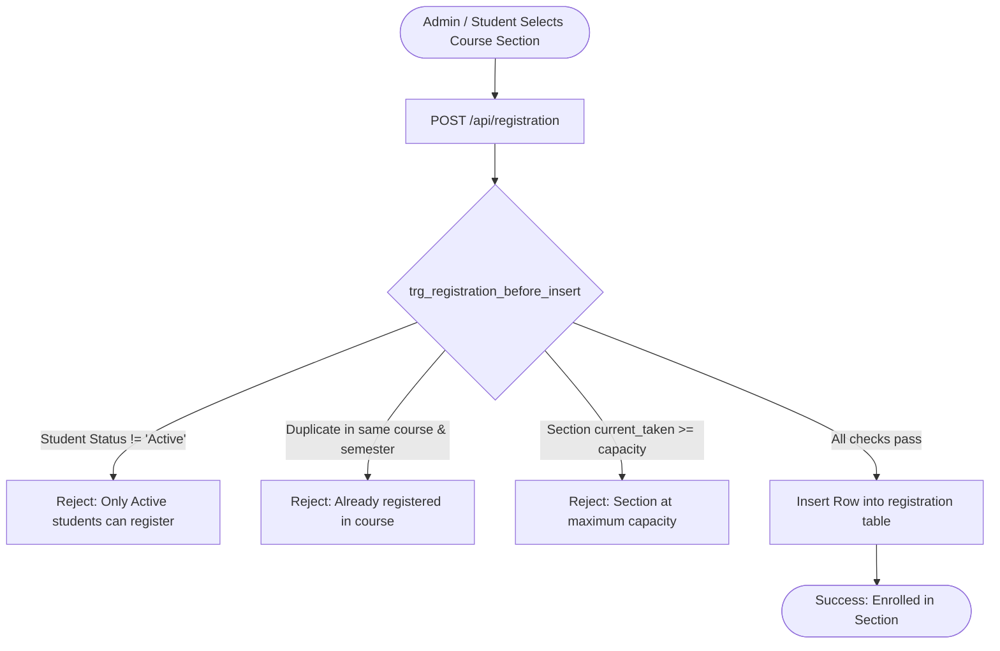

<div align="center">



# Student & College Management System

### A DBMS PBL project built with React, Flask and MySQL

> A database-driven web application for managing students, academic records, course registration, attendance, examinations, and fee transactions.

[](https://react.dev/)
[](https://vitejs.dev/)
[](https://www.python.org/)
[](https://flask.palletsprojects.com/)
[](https://www.mysql.com/)
[](LICENSE)

</div>

---

## Project Snapshot

| Category | Details |
|---|---|
| **Project** | Student & College Management System (SCMS) |
| **Project Type** | DBMS Project Based Learning (PBL) |
| **Frontend** | React 19 + Vite + React Router v7 |
| **Backend** | Python 3 + Flask REST API |
| **Database** | MySQL 8.0+ (InnoDB Storage Engine) |
| **Database Driver** | `mysql-connector-python` |
| **Authentication** | bcrypt + PyJWT (Academic Demonstration Auth) |
| **Database Concepts** | Constraints, Triggers, Stored Procedures, Views, Transactions |
| **Student Author** | **Vardan Desai** (Roll No: `25WU0104029`) |
| **Degree & Batch** | B.Tech CSE – AIML (Rhinos) |
| **Institution** | **Woxsen University** |

---

## Table of Contents

- [Problem Statement](#problem-statement)
- [Objectives](#objectives)
- [Main Features](#main-features)
- [Database Design](#database-design)
- [Entity-Relationship Diagram](#entity-relationship-diagram)
- [Key Relationships](#key-relationships)
- [DBMS Concepts Demonstrated](#dbms-concepts-demonstrated)
- [Database Triggers](#database-triggers)
- [Stored Procedures](#stored-procedures)
- [SQL Views](#sql-views)
- [System Architecture](#system-architecture)
- [Application Flow](#application-flow)
- [Reporting](#reporting)
- [Technology Stack](#technology-stack)
- [Repository Structure](#repository-structure)
- [Local Setup](#local-setup)
- [Demonstration Accounts](#demonstration-accounts)
- [Database Rule Testing](#database-rule-testing)
- [Database Normalization](#database-normalization)
- [Authentication Model](#authentication-model)
- [Limitations](#limitations)
- [Future Scope](#future-scope)
- [Academic Documentation](#academic-documentation)
- [Contributing & Community](#contributing--community)
- [License & Citation](#license--citation)

---

## Problem Statement

College academic operations involve multiple interrelated entities: students, degree programmes, departments, faculty members, courses, terms, sections, course enrollments, attendance sessions, exam marks, and tuition billing.

When these operations are tracked in disparate spreadsheets or basic forms without database-level constraints, critical institutional problems arise:
- **Redundancy and Data Anomalies**: Inconsistent student or course information across departments.
- **Over-enrollment**: Course sections accepting students beyond classroom seat capacity.
- **Duplicate Enrollments**: Students registering for multiple sections of the same course in a single semester.
- **Erroneous Attendance**: Attendance marked for future dates or outside the semester schedule.
- **Accounting Discrepancies**: Students paying amounts exceeding their remaining invoice balances.

This project demonstrates how a **relational database schema** paired with declarative constraints, procedural triggers, stored procedures, and analytical views guarantees data consistency directly inside MySQL, while providing an intuitive web interface for students and administrators.

---

## Objectives

- Design a normalized relational schema (15 tables) modeling college academic and administrative entities.
- Demonstrate **referential integrity** using primary keys, foreign keys (`RESTRICT` and `CASCADE`), and surrogate keys.
- Enforce domain integrity via `UNIQUE`, `NOT NULL`, and `CHECK` constraints.
- Implement MySQL **triggers** to enforce real-world business rules (capacity limits, duplicate prevention, date validation, and balance checks).
- Implement MySQL **stored procedures** with explicit transaction handling and rollback capabilities for multi-table inserts.
- Build pre-aggregated **SQL analytical views** to supply instant operational reports without application-level computation.
- Connect the MySQL database to a lightweight **Flask REST API** using `mysql-connector-python`.
- Provide a responsive **React interface** to interact with all database operations.

---

## Main Features

### 🎓 Student Management
- Student profile directory with search, filtering, and detailed status tracking (`Active`, `Inactive`, `Graduated`, `Withdrawn`).
- Atomic student admission capturing personal, academic, and parent/guardian contact details.
- Comprehensive student details view displaying academic history, course enrollments, and tuition fee ledgers.

### 🏛️ Academic Management
- **Departments & Programmes**: Management of academic divisions and degree curriculums with fixed duration years.
- **Course Catalog**: Courses with defined credit ratings and categories (`Core`, `Elective`, `Lab`, `Project`).
- **Faculty Directory**: Teaching faculty assignments with employee codes and designations.
- **Semesters & Sections**: Academic calendar terms and course sections with assigned lecture halls and seat capacities.

### 📝 Course Registration
- Enrollment of active students into course sections for the current academic term.
- Enforces section seat capacity limits directly at the database level.
- Prevents duplicate registration in another section of the same course in the same semester.
- Restricts enrollment to students with `Active` academic status.

### 📅 Attendance Tracking
- Daily attendance roster by course section.
- Session marking across statuses (`Present`, `Absent`, `Late`).
- Attendance percentage calculation highlighting students facing shortage (< 75%).
- Database triggers block recording attendance on future dates or outside the scheduled term.

### 📊 Examinations & Grading
- Marks recording across assessment types (`Mid-Term`, `End-Term`, `Internal`, `Practical`).
- Automatic grade calculation via database triggers based on percentage thresholds (`A+` down to `F`).
- Automated grade point assignment on a 10.0 scale.

### 💳 Fee Management & Billing
- Semester tuition fee bill generation with amounts and payment due dates.
- Payment recording across modes (`Cash`, `UPI`, `Card`, `NEFT`, `Cheque`, `DD`).
- Database trigger prevents overpayment beyond the outstanding bill balance.
- Automatic fee bill status synchronization (`Unpaid`, `Partially Paid`, `Paid`).

### 📈 Analytical Reports
- 8 dedicated SQL views powering operational insights: section occupancy, attendance shortage, exam performance, academic transcripts, outstanding dues, and departmental metrics.

### 🔐 Demonstration Authentication
- Academic demonstration login system supporting roles (`admin`, `faculty`, `accounts`, `student`).
- Password hash verification using `bcrypt` and signed JSON Web Tokens (`PyJWT`).

---

## Database Design

The database contains **15 tables** implemented in MySQL 8.0+ using the `InnoDB` storage engine:

| Table | Purpose | Primary Key | Key Foreign Keys |
|---|---|---|---|
| `department` | Academic departments (CSE, ECE, ME, SOM, BSH) | `dept_id` | — |
| `programme` | Degree curriculums under departments | `programme_id` | `dept_id` → `department` |
| `faculty` | Teaching faculty directory | `faculty_id` | `dept_id` → `department` |
| `course` | Course curriculum catalog | `course_id` | `dept_id` → `department` |
| `semester` | Academic calendar terms | `semester_id` | — |
| `section` | Course cohort allocations | `section_id` | `course_id`, `faculty_id`, `semester_id` |
| `student` | Student personal and admission records | `student_id` | `programme_id` → `programme` |
| `guardian` | Linked parent / guardian contact info | `guardian_id` | `student_id` → `student` |
| `registration` | Student course section enrollment | `registration_id` | `student_id`, `section_id` |
| `attendance` | Daily session attendance ledger | `attendance_id` | `registration_id` → `registration` |
| `examination` | Assessment marks recorded | `exam_id` | `registration_id` → `registration` |
| `grade` | Deterministic grade derived from exam | `grade_id` | `exam_id` → `examination` (`CASCADE`) |
| `fee_bill` | Semester tuition fee invoice | `bill_id` | `student_id`, `semester_id` |
| `payment` | Payment ledger entries | `payment_id` | `bill_id` → `fee_bill` |
| `user_account` | Application credentials & roles | `user_id` | `student_id`, `faculty_id` |

*For full column definitions and schema SQL, see [docs/database-design.md](docs/database-design.md).*

---

## Entity-Relationship Diagram



---

## Key Relationships

- **Department → Programme** (`1 : N`): A department administers one or more degree programmes.
- **Department → Faculty** (`1 : N`): A department employs multiple faculty members.
- **Department → Course** (`1 : N`): Academic departments offer specific courses.
- **Course + Faculty + Semester → Section** (`M : 1`): Each section represents a specific course taught by a faculty member in a defined semester.
- **Student → Guardian** (`1 : 1` or `1 : 0`): Each student is linked to primary guardian contact information.
- **Student + Section → Registration** (`M : N` via junction table): Students enroll into sections through `registration`.
- **Registration → Attendance** (`1 : N`): Each attendance record tracks student presence for an enrolled section.
- **Registration → Examination → Grade** (`1 : N` and `1 : 1`): Examinations belong to registrations; grades are derived directly from individual examination marks.
- **Student + Semester → Fee Bill → Payment** (`1 : N` and `1 : N`): Fee bills are generated per student and semester, against which multiple payments may be applied.

---

## DBMS Concepts Demonstrated

### 1. Primary & Surrogate Keys
Auto-incrementing integer surrogate keys (`INT AUTO_INCREMENT PRIMARY KEY`) are used across all tables for efficient joins, stable indexing, and minimal storage overhead.

### 2. Foreign Keys & Referential Integrity
Relationships between tables are enforced via foreign keys with `ON DELETE RESTRICT` (preventing accidental deletion of departments, courses, or students with dependent records) and `ON DELETE CASCADE` (specifically on `grade` referencing `examination`).

### 3. UNIQUE Constraints
Domain uniqueness is enforced on:
- `student.reg_no` and `student.email`
- `faculty.employee_code` and `faculty.email`
- `course.course_code` and `department.dept_code`
- `semester (academic_year, term)`
- `section (course_id, semester_id, section_code)`
- `registration (student_id, section_id)`
- `examination (registration_id, exam_type)`
- `fee_bill (student_id, semester_id)`

### 4. NOT NULL & Domain CHECK Constraints
- Credit limits: `credits > 0`
- Capacity: `capacity > 0`
- Date logic: `dob < admission_date` and `end_date >= start_date`
- Exam marks: `max_marks > 0` and `marks >= 0 AND marks <= max_marks`
- Enumerations: `term IN ('Odd', 'Even', 'Summer')`, `payment_mode IN ('Cash', 'UPI', 'Card', 'NEFT', 'Cheque', 'DD')`, etc.

### 5. ACID Transactions
Multi-table inserts (e.g., student admission and exam recording) are executed within atomic database transactions with explicit error handlers and automatic rollback on failure.

---

## Database Triggers

Located in `database/triggers.sql`. The system defines 6 database triggers enforcing business rules inside MySQL:

### 1. Registration Capacity & Inactive Check
**`trg_registration_before_insert`** (BEFORE INSERT on `registration`)
- Rejects registration if student status is not `Active`.
- Prevents duplicate registration in another section of the same course during the same semester.
- Aborts registration with `SQLSTATE '45000'` if the section has reached its maximum seat capacity.

### 2. Attendance Date & Status Check
**`trg_attendance_before_insert`** (BEFORE INSERT on `attendance`)
- Rejects attendance logging for dropped course registrations.
- Rejects attendance with dates in the future (`attendance_date > CURRENT_DATE()`).
- Rejects attendance dates falling outside the scheduled semester date range.

### 3. Overpayment Prevention
**`trg_payment_before_insert`** (BEFORE INSERT on `payment`)
- Queries the total paid against the bill (`amount_due - COALESCE(SUM(amount_paid), 0)`).
- Rejects payment with `SQLSTATE '45000'` if `amount_paid` exceeds the remaining balance.

### 4. Fee Bill Status Synchronization
**`trg_payment_after_insert`** (AFTER INSERT on `payment`)
- Re-evaluates total payments against `amount_due`.
- Automatically synchronizes `fee_bill.status` to `Paid`, `Partially Paid`, or `Unpaid`.

### 5. Deterministic Examination Grading
**`trg_examination_after_insert` & `trg_examination_after_update`** (AFTER INSERT/UPDATE on `examination`)
- Calculates percentage: `(marks * 100.0) / max_marks`.
- Automatically inserts or updates letter grades and grade points in the `grade` table:

| Percentage Range | Grade Letter | Grade Point |
|---|:---:|:---:|
| ≥ 90.0% | **A+** | 10.0 |
| ≥ 80.0% | **A** | 9.0 |
| ≥ 70.0% | **B+** | 8.0 |
| ≥ 60.0% | **B** | 7.0 |
| ≥ 50.0% | **C** | 6.0 |
| ≥ 40.0% | **D** | 5.0 |
| < 40.0% | **F** | 0.0 |

*For complete trigger SQL code, see [docs/database-rules.md](docs/database-rules.md).*

---

## Stored Procedures

Located in `database/procedures.sql`. Stored procedures coordinate multi-table transactional workflows with automatic rollback (`DECLARE EXIT HANDLER FOR SQLEXCEPTION`):

### 1. `sp_admit_student`
Performs atomic admission by inserting a student record into `student` and an associated contact record into `guardian` within a single database transaction. Returns the generated `student_id`.

```sql
CALL sp_admit_student(
    programme_id, reg_no, full_name, dob, email, phone, admission_date,
    guardian_name, guardian_relation, guardian_phone, guardian_email, guardian_address,
    @new_student_id
);
```

### 2. `sp_record_exam_result`
Atomically records examination marks for a student registration inside a transaction, supporting updates via `ON DUPLICATE KEY UPDATE` and returning the generated `exam_id` (which triggers the grading trigger).

```sql
CALL sp_record_exam_result(
    registration_id, exam_type, exam_date, marks, max_marks, @new_exam_id
);
```

---

## SQL Views

Located in `database/views.sql`. SCMS utilizes 8 analytical views to offload reporting computation from the application server to MySQL:

| View Name | Description |
|---|---|
| `v_section_occupancy` | Calculates active student enrollment, available capacity, and full flag per section. |
| `v_attendance_summary` | Aggregates class sessions and flags students with attendance shortage (< 75%). |
| `v_exam_details` | Combines student, section, course, exam marks, and computed grade details. |
| `v_result_analysis` | Computes average, highest, lowest scores, and pass percentages per course section. |
| `v_student_academic_history` | Compiles a student's full course transcript, exam marks, final grade, and attendance percentage. |
| `v_fee_dues` | Details semester tuition fee bills, amounts paid, remaining balance, and overdue days. |
| `v_student_dues` | Aggregates total billed, total paid, and outstanding balances grouped by student. |
| `v_department_summary` | Rolls up counts of programmes, active faculty, courses, and enrolled students per department. |

---

## System Architecture

SCMS is built on a clean three-tier architecture separating presentation, API routing, and database integrity:

```
┌────────────────────────────────────────────────────────┐
│                     Client Tier                        │
│             React 19 + Vite + React Router             │
│            Component UI & CSS Design System            │
└───────────────────────────┬────────────────────────────┘
                            │ HTTP / JSON Requests
                            ▼
┌────────────────────────────────────────────────────────┐
│                   Application Tier                     │
│               Python 3 + Flask REST API                │
│    Blueprints: Students, Academics, Reg, Exams, Fees   │
│             mysql-connector-python Driver              │
└───────────────────────────┬────────────────────────────┘
                            │ Parameterized SQL Queries
                            ▼
┌────────────────────────────────────────────────────────┐
│                    Database Tier                       │
│               MySQL 8.0+ (InnoDB Engine)               │
│    15 Relational Tables  •  Constraints  •  Indexes    │
│    Triggers  •  Stored Procedures  •  SQL Views        │
└────────────────────────────────────────────────────────┘
```

---

## Application Flow

### General Request Flow


### Business Rule Example: Course Registration


---

## Reporting

SCMS handles reporting by pushing calculations directly into MySQL via **Analytical SQL Views** instead of fetching raw rows and computing aggregations in Python or JavaScript:

```
Database Tables
(student, section, attendance, examination, fee_bill, payment)
      │
      ▼
SQL Views (database/views.sql)
(Aggregations, JOINs, CASE expressions, Window calculations)
      │
      ▼
Flask Reports API (server/routes/reports.py)
(Simple SELECT * FROM v_... queries)
      │
      ▼
React Reports Page (src/pages/Reports.jsx)
(Interactive tabbed reports interface)
```

Report categories available in the application:
1. **Section Occupancy**: Capacity utilization and seat availability.
2. **Attendance Shortage**: Students with overall attendance below 75%.
3. **Examination Results**: High, low, and average marks with pass rates.
4. **Academic History**: Comprehensive transcript records by student.
5. **Fee Dues Ledger**: Outstanding balances and overdue payment tracking.
6. **Departmental Summary**: Resource allocations and student counts.

---

## Technology Stack

| Layer | Technology | Version | Purpose |
|---|---|---|---|
| **Frontend Framework** | React | 19.2 | Component-based user interface |
| **Build Tool & Bundler** | Vite | 8.3 | Fast development server and production bundler |
| **Client Routing** | React Router | 7.18 | Single-page application client routing |
| **Styling** | Vanilla CSS | CSS3 | Custom university theme and responsive design system |
| **Backend Language** | Python | 3.10+ | Server-side execution and API development |
| **Backend Framework** | Flask | 3.0+ | Lightweight REST API routing and request handling |
| **Database Connector** | `mysql-connector-python` | 8.3+ | Official Python driver for MySQL |
| **Password Security** | `bcrypt` | 4.1+ | Password hashing and verification |
| **Token Verification** | `PyJWT` | 2.8+ | Stateless JSON Web Token signing |
| **Database Engine** | MySQL | 8.0+ | Relational data persistence, triggers, and procedures |
| **Version Control** | Git & GitHub | — | Source code control and documentation |

---

## Repository Structure

```
dbms-pbl/
├── .github/
│   ├── ISSUE_TEMPLATE/
│   │   ├── bug_report.md          # Bug report submission template
│   │   └── feature_request.md     # Feature suggestion template
│   └── PULL_REQUEST_TEMPLATE.md   # Pull request checklist with database review
├── database/
│   ├── schema.sql                 # 15 relational tables, constraints, and indexes
│   ├── triggers.sql               # 6 business rule triggers
│   ├── procedures.sql             # Stored procedures for atomic admissions & exams
│   ├── views.sql                  # 8 analytical SQL reporting views
│   └── seed.sql                   # Sample university records and test scenarios
├── docs/
│   ├── assets/
│   │   └── banner.png             # Repository header graphic
│   ├── architecture.md            # System architecture and layer breakdown
│   ├── database-design.md         # Schema catalog, ERD, and normalization
│   ├── database-rules.md          # In-depth triggers, procedures, and views guide
│   ├── testing.md                 # Step-by-step database rule test scenarios
│   ├── setup.md                   # Detailed local installation guide
│   └── Final_Video_Link.md        # Academic demonstration video walkthrough
├── server/
│   ├── routes/
│   │   ├── academics.py           # Departments, programmes, courses, faculty, sections
│   │   ├── attendance.py          # Section attendance rosters and recording
│   │   ├── auth.py                # Login endpoint and JWT issuance
│   │   ├── dashboard.py           # Live institutional KPI metrics
│   │   ├── examinations.py        # Assessment marks and procedure caller
│   │   ├── fees.py                # Fee billing, payments, and receipts
│   │   ├── registration.py        # Course section enrollments
│   │   ├── reports.py             # View-querying report endpoints
│   │   └── students.py            # Student CRUD and admission procedure caller
│   ├── app.py                     # Flask entry point and CORS configuration
│   ├── db.py                      # MySQL connection pool and data sanitizer
│   └── requirements.txt           # Python backend dependencies
├── src/
│   ├── components/
│   │   └── Layout.jsx             # Navigation sidebar, top bar, and role switcher
│   ├── context/
│   │   └── AuthContext.jsx        # Authentication state and token persistence
│   ├── lib/
│   │   ├── api.js                 # HTTP fetch client for backend endpoints
│   │   └── errors.js              # Database error formatter
│   ├── pages/
│   │   ├── Attendance.jsx         # Attendance recording interface
│   │   ├── Courses.jsx            # Course catalog management
│   │   ├── Dashboard.jsx          # Institutional overview dashboard
│   │   ├── Departments.jsx        # Department and programme listings
│   │   ├── Examinations.jsx       # Marks entry and grade viewing
│   │   ├── Faculty.jsx            # Faculty directory
│   │   ├── Fees.jsx               # Tuition bills and payment ledger
│   │   ├── Login.jsx              # Application login interface
│   │   ├── Registration.jsx       # Course section registration
│   │   ├── Reports.jsx            # Analytical reports tab interface
│   │   ├── Sections.jsx           # Section management and allocation
│   │   ├── Semesters.jsx          # Academic calendar terms
│   │   ├── StudentDetails.jsx     # Longitudinal student transcript and history
│   │   └── Students.jsx           # Student directory and admission modal
│   ├── App.jsx                    # Client route definitions and ProtectedRoute
│   ├── index.css                  # CSS design tokens and layouts
│   └── main.jsx                   # React application mount
├── .env.example                   # Environment configuration template
├── .gitignore                     # Git ignore patterns
├── CITATION.cff                   # Academic citation metadata
├── CODE_OF_CONDUCT.md             # Contributor code of conduct
├── CONTRIBUTING.md                # Contribution guidelines
├── LICENSE                        # MIT License
├── package.json                   # Frontend npm packages and run scripts
├── README.md                      # Primary project documentation
└── vite.config.js                 # Vite bundler configuration with API proxy
```

---

## Local Setup

### Prerequisites
- **Node.js** (v18+) & `npm`
- **Python** (v3.10+) & `pip`
- **MySQL Server** (v8.0+) running locally on port `3306`

### 1. Clone Repository
```bash
git clone https://github.com/404Vardan/dbms-pbl.git
cd dbms-pbl
```

### 2. Set Up the MySQL Database
Run the migration scripts in exact order using the MySQL CLI or MySQL Workbench:
```bash
mysql -u root -p < database/schema.sql
mysql -u root -p < database/triggers.sql
mysql -u root -p < database/procedures.sql
mysql -u root -p < database/views.sql
mysql -u root -p < database/seed.sql
```

### 3. Configure Environment Variables
Copy `.env.example` to `.env` in the root folder:
```bash
cp .env.example .env
```
Update `.env` with your local MySQL password:
```env
DB_HOST=localhost
DB_PORT=3306
DB_USER=root
DB_PASSWORD=your_actual_mysql_password
DB_NAME=scms_db

PORT=5000
JWT_SECRET=scms_jwt_secret_university_erp_2026
```

### 4. Install Dependencies
```bash
# Install backend Python dependencies
pip install -r server/requirements.txt

# Install frontend Node dependencies
npm install
```

### 5. Start the Application
Run both backend and frontend concurrently:
```bash
npm start
```
*Or in separate terminal windows:*
- **Backend API**: `python server/app.py` (Listens on `http://localhost:5000`)
- **Frontend UI**: `npm run dev` (Listens on `http://localhost:5173`)

Open [http://localhost:5173](http://localhost:5173) in your web browser.

*For complete setup instructions and troubleshooting, see [docs/setup.md](docs/setup.md).*

---

## Demonstration Accounts

The database comes pre-seeded with four demonstration accounts (`database/seed.sql`):

| Role | Email Address | Password | Demonstration Scope |
|---|---|---|---|
| **Admin** | `registrar@scms.edu.in` | `Demo@12345` | Full administrative operations across all modules |
| **Faculty** | `priya.raghavan@scms.edu.in` | `Demo@12345` | Course rosters, attendance marking, examination grading |
| **Accounts** | `accounts@scms.edu.in` | `Demo@12345` | Tuition billing, payment ledger, recovery reports |
| **Student** | `meera.nair@students.scms.edu.in` | `Demo@12345` | Student profile, registered courses, personal fee dues |

---

## Database Rule Testing

The project incorporates test scenarios directly verifiable through the web UI or MySQL CLI:

| Test Scenario | Input Action | Expected Database Behavior |
|---|---|---|
| **1. Student Admission** | Call `sp_admit_student` with student + guardian details | Atomically inserts rows in both `student` and `guardian` tables within a single transaction. |
| **2. Duplicate Registration** | Enroll student in another section of the same course/semester | Rejected by `trg_registration_before_insert` with error: *Student is already registered in another section for this course...* |
| **3. Section Capacity** | Register into full Section CS203-B (capacity: 3/3) | Rejected by `trg_registration_before_insert` with error: *This section has reached maximum student capacity.* |
| **4. Invalid Attendance** | Record attendance with future date or date outside semester | Rejected by `trg_attendance_before_insert` with error: *Attendance cannot be recorded for a future date.* |
| **5. Grade Calculation** | Enter exam score (e.g. 84 / 100) | `trg_examination_after_insert` automatically writes `A` (9.0) into the `grade` table. |
| **6. Fee Overpayment** | Pay ₹50,000 towards an invoice with ₹42,500 balance | Rejected by `trg_payment_before_insert` with error: *Total payment cannot exceed the remaining balance due.* |

*For SQL execution commands and verification queries, see [docs/testing.md](docs/testing.md).*

---

## Example Database Queries

<details>
<summary><b>Click to expand representative SQL queries from the project</b></summary>

### 1. Section Occupancy with Remaining Seats
```sql
SELECT 
    s.section_id,
    c.course_code,
    c.course_name,
    s.section_code,
    s.capacity,
    COUNT(CASE WHEN r.status != 'Dropped' THEN r.registration_id END) AS registered_count,
    s.capacity - COUNT(CASE WHEN r.status != 'Dropped' THEN r.registration_id END) AS remaining_seats,
    ROUND(100.0 * COUNT(CASE WHEN r.status != 'Dropped' THEN r.registration_id END) / s.capacity, 1) AS occupancy_pct
FROM section s
JOIN course c ON c.course_id = s.course_id
LEFT JOIN registration r ON r.section_id = s.section_id
GROUP BY s.section_id, c.course_id;
```

### 2. Identifying Students with Attendance Shortage (< 75%)
```sql
SELECT 
    st.reg_no,
    st.full_name AS student_name,
    c.course_code,
    COUNT(a.attendance_id) AS total_classes,
    SUM(CASE WHEN a.status = 'Present' THEN 1 ELSE 0 END) AS present_count,
    ROUND(100.0 * SUM(CASE WHEN a.status IN ('Present', 'Late') THEN 1 ELSE 0 END) / COUNT(a.attendance_id), 1) AS attendance_pct
FROM registration r
JOIN student st ON st.student_id = r.student_id
JOIN section s ON s.section_id = r.section_id
JOIN course c ON c.course_id = s.course_id
JOIN attendance a ON a.registration_id = r.registration_id
WHERE r.status != 'Dropped'
GROUP BY r.registration_id, st.student_id, c.course_id
HAVING attendance_pct < 75.0;
```

### 3. Student Longitudinal Academic Transcript
```sql
SELECT 
    st.reg_no,
    st.full_name,
    c.course_code,
    c.course_name,
    c.credits,
    MAX(CASE WHEN e.exam_type = 'Mid-Term' THEN e.marks END) AS mid_term,
    MAX(CASE WHEN e.exam_type = 'End-Term' THEN e.marks END) AS end_term,
    MAX(CASE WHEN e.exam_type = 'End-Term' THEN g.grade_letter END) AS final_grade,
    MAX(CASE WHEN e.exam_type = 'End-Term' THEN g.grade_point END) AS grade_point
FROM registration r
JOIN student st ON st.student_id = r.student_id
JOIN section s ON s.section_id = r.section_id
JOIN course c ON c.course_id = s.course_id
LEFT JOIN examination e ON e.registration_id = r.registration_id
LEFT JOIN grade g ON g.exam_id = e.exam_id
WHERE st.reg_no = '25CSE001'
GROUP BY r.registration_id, st.student_id, c.course_id;
```

### 4. Outstanding Tuition Balance per Student
```sql
SELECT 
    st.reg_no,
    st.full_name,
    SUM(b.amount_due) AS total_billed,
    COALESCE(SUM(p.amount_paid), 0) AS total_paid,
    SUM(b.amount_due) - COALESCE(SUM(p.amount_paid), 0) AS outstanding_balance
FROM fee_bill b
JOIN student st ON st.student_id = b.student_id
LEFT JOIN payment p ON p.bill_id = b.bill_id
GROUP BY st.student_id, st.reg_no, st.full_name
HAVING outstanding_balance > 0;
```

</details>

---

## Database Normalization

The schema was designed following relational normalization principles to minimize redundancy and eliminate data anomalies:

### First Normal Form (1NF)
- All columns contain atomic, indivisible scalar values.
- Repeating contact details (e.g., guardian phone, email, and address) are extracted into a separate `guardian` entity rather than flattened into the `student` table.
- Multi-assessment examination marks are stored as separate rows in `examination` rather than as multiple marks columns on `registration`.

### Second Normal Form (2NF)
- The schema satisfies 1NF.
- All non-key attributes are fully functionally dependent on the primary key.
- In `registration`, attributes like `registered_on` and `status` depend strictly on the enrollment surrogate key `registration_id`. Attributes relating to the section (room, capacity) or course (credits) are isolated in `section` and `course`.

### Third Normal Form (3NF)
- The schema satisfies 2NF.
- Non-key attributes depend only on candidate keys with no transitive dependencies.
- `student` stores `programme_id`, but does not store department information; the department is derived via `programme -> department`.
- `payment` records reference `bill_id`, but do not duplicate `student_id` or `amount_due`.
- `grade` is isolated from `examination` and derives its values strictly via deterministic logic keyed on `exam_id`.

---

## Authentication Model

The authentication mechanism is designed for **academic demonstration**:
- **Credential Storage**: User accounts reside in the `user_account` table with passwords hashed using `bcrypt`.
- **Session Tokens**: Successful logins return signed JSON Web Tokens (`PyJWT`) containing `userId`, `role`, and `email`.
- **Client Navigation**: React's `AuthContext` and `ProtectedRoute` guard UI routes based on token presence.

> **Scope Note**: Server-side endpoints validate database inputs and business logic via SQL constraints and triggers. Granular, production-grade role authorization middleware is not implemented across every API route, as the focus of this academic project is database management concepts.

---

## Limitations

- **Academic PBL Scope**: Developed as an educational demonstration of relational database design, constraints, triggers, and views. It is not an enterprise ERP.
- **Local MySQL Dependency**: Requires a locally running MySQL 8.0+ instance with administrative privileges to apply triggers and procedures.
- **Client-Side Role Routing**: Role permissions are managed on the client interface and token level for demonstration purposes.
- **Testing Approach**: Employs manual scenario-based verification rather than an automated end-to-end testing pipeline.

---

## Future Scope

- **Role-Based Authorization Middleware**: Enforcing strict server-side permission checks across all Flask endpoints.
- **Cloud Database Deployment**: Migrating MySQL hosting to a managed cloud database service.
- **Report Export Formats**: Adding direct PDF and Excel/CSV download capabilities for all 8 analytical views.
- **Communication Alerts**: Automated email notifications for attendance shortages and fee payment deadlines.
- **Automated Integration Tests**: Introducing a pytest-based test suite for automated database trigger and procedure validation.

---

## Academic Documentation

In-depth technical documentation is available in the `docs/` folder:

- 🏛️ [System Architecture](docs/architecture.md) — Layer breakdown, component diagram, and request lifecycle.
- 📐 [Database Design & ERD](docs/database-design.md) — Relational schema catalog, ER diagram, indexing, and normalization.
- ⚙️ [Database Rules](docs/database-rules.md) — Complete specifications for triggers, stored procedures, and SQL views.
- 🧪 [Database Rule Testing](docs/testing.md) — Step-by-step test scenarios and expected SQLSTATE outputs.
- 🛠️ [Installation & Setup](docs/setup.md) — Prerequisites, database migrations, and local environment launch.
- 🎥 [Demo Walkthrough Video Agenda](docs/Final_Video_Link.md) — 5-minute academic demonstration outline.

---

## Contributing & Community

Contributions and constructive feedback are welcome! Please review:
- [CONTRIBUTING.md](CONTRIBUTING.md) for branch management and pull request workflows.
- [CODE_OF_CONDUCT.md](CODE_OF_CONDUCT.md) for community standards.

---

## License & Citation

This project is licensed under the **MIT License** — see the [LICENSE](LICENSE) file for details.

If you reference or use this project in your academic coursework, please cite it using [CITATION.cff](CITATION.cff):

```bibtex
@software{Desai_SCMS_2026,
  author = {Desai, Vardan},
  title = {{Student & College Management System (SCMS): A Database-Driven Application for University Academic and Administrative Workflows}},
  year = {2026},
  url = {https://github.com/404Vardan/dbms-pbl}
}
```

---

<div align="center">

**Student & College Management System (SCMS)**  
Developed by **Vardan Desai** (`25WU0104029`)  
B.Tech CSE – AIML (Rhinos) • School of Technology • **Woxsen University**

</div>
