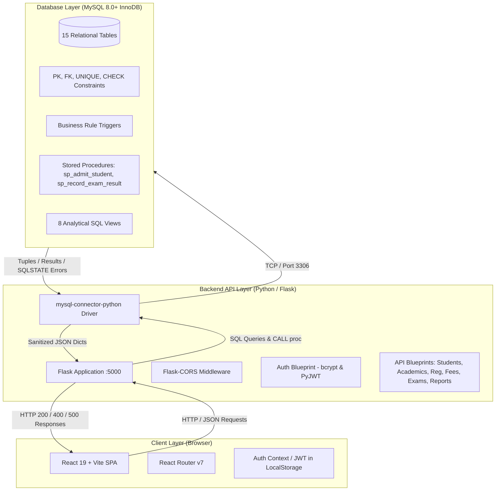
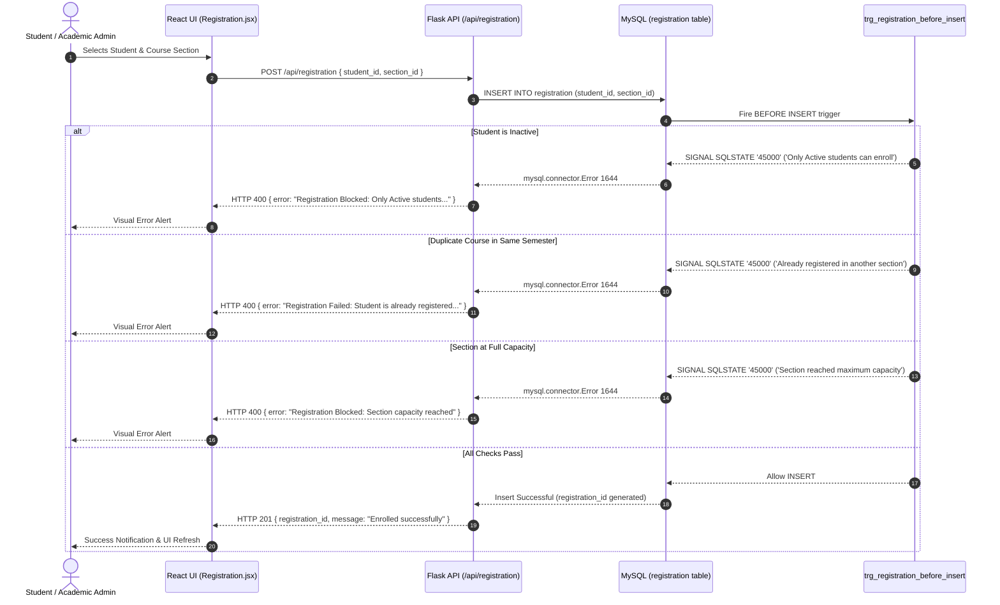

# System Architecture

The **Student & College Management System (SCMS)** is designed as a three-tier database-driven web application developed for an undergraduate Database Management Systems (DBMS) Project-Based Learning (PBL) curriculum.

The system emphasizes **database-centric data integrity**, delegating critical business logic, domain constraints, state validation, and transactional consistency to the relational database engine (MySQL 8.0+ with InnoDB), while utilizing a lightweight Python/Flask backend for REST APIs and a responsive React frontend for user interaction.

---

## 1. Architectural Overview



---

## 2. Layer Breakdown

### Tier 1 — Presentation Layer (Frontend)
- **Framework**: React 19 bootstrapped with Vite.
- **Routing**: React Router (`react-router-dom` v7) providing client-side route navigation and component rendering.
- **State & Session Management**: React Context (`AuthContext`) storing active user profile details and signed JWT tokens in browser `localStorage`.
- **Styling**: Vanilla CSS design system (`src/index.css`) utilizing modern CSS custom properties, responsive grid layouts, card surfaces, and accessible UI controls.
- **API Communication**: Asynchronous HTTP helper functions (`src/lib/api.js`) consuming REST endpoints exposed by the Flask server through a Vite development proxy.

### Tier 2 — Application & API Layer (Backend)
- **Framework**: Python 3.10+ with Flask.
- **Architecture**: Modular blueprint routing architecture (`server/routes/`):
  - `auth.py`: Credential verification via bcrypt and HS256 JWT issuance.
  - `students.py`: Student records, profile details, and stored procedure execution (`sp_admit_student`).
  - `academics.py`: Department, programme, faculty, course, semester, and section lookups.
  - `registration.py`: Course section enrollment and drop management.
  - `attendance.py`: Daily attendance rosters and batch recording.
  - `examinations.py`: Marks logging and procedure dispatch (`sp_record_exam_result`).
  - `fees.py`: Semester fee bills, payment transactions, and ledger history.
  - `reports.py`: Direct pass-through queries to relational database views.
  - `dashboard.py`: Aggregate institutional KPI metrics.
- **Database Connector**: `mysql-connector-python` executing parameterized SQL queries to prevent SQL injection vulnerabilities.
- **Data Sanitization**: `server/db.py` handles conversion of Python `Decimal`, `date`, and `datetime` types into JSON-serializable primitives.

### Tier 3 — Persistence & Integrity Layer (Database)
- **Engine**: MySQL 8.0+ using the `InnoDB` storage engine for ACID transaction compliance.
- **Schema**: 15 normalized tables (14 academic domain tables + 1 application user account table).
- **Integrity**:
  - Declarative constraints (`PRIMARY KEY`, `FOREIGN KEY` with `RESTRICT` and `CASCADE`, `UNIQUE`, `NOT NULL`, and `CHECK`).
  - Procedural triggers enforcing multi-table business constraints before and after mutations.
  - Atomic stored procedures coordinating multi-table inserts within explicit database transactions.
  - Analytical views delivering aggregated institutional insights directly from the database engine.

---

## 3. End-to-End Request Lifecycle

### Case Study: Course Section Registration

The registration workflow demonstrates how the three tiers interact and how database triggers enforce business invariants:



---

## 4. Reporting Architecture

Instead of fetching large volumes of raw rows and aggregating them in application memory, SCMS pushes computation directly to MySQL through **Analytical SQL Views**:

```
[Raw Tables]
student, section, course, attendance, examination, grade, fee_bill, payment
      │
      ▼ (Aggregations, JOINs, CASE expressions, window functions)
[MySQL Analytical Views]
v_section_occupancy, v_attendance_summary, v_result_analysis, etc.
      │
      ▼ (Clean SELECT queries via /api/reports/<tab>)
[Flask Backend]
server/routes/reports.py
      │
      ▼ (JSON Response)
[React UI]
Tabular Reporting Interface (src/pages/Reports.jsx)
```

This design keeps the API server stateless and lightweight while utilizing the query execution and index optimization capabilities of the MySQL database engine.
