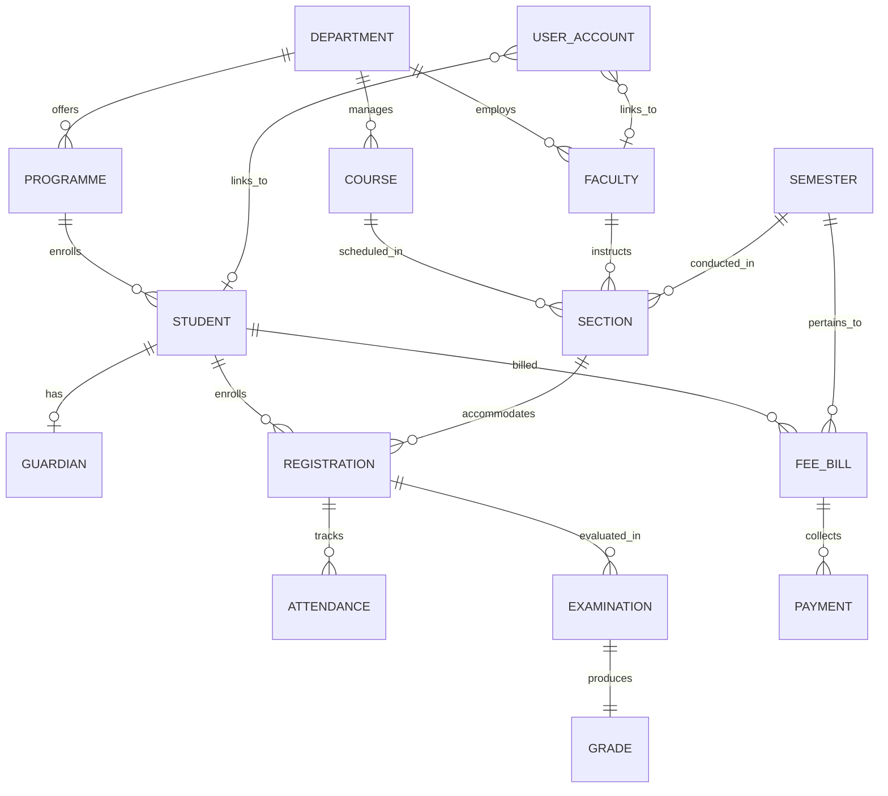

# Database Design & Relational Schema

The database for the **Student & College Management System (SCMS)** is implemented in **MySQL 8.0+** using the **InnoDB** storage engine. The schema models academic and administrative entities across an educational institution, providing referential integrity, strong constraint checking, and normalized table structures.

---

## 1. Entity-Relationship Diagram (ERD)



---

## 2. Table Catalog

The schema comprises **15 tables** categorized into Academic Hierarchy, Student & Enrollment, Assessment, Financial Management, and System Access:

| Table Name | Category | Primary Key | Description |
|---|---|---|---|
| `department` | Academic Hierarchy | `dept_id` | Academic departments (e.g., CSE, ECE, SOM). |
| `programme` | Academic Hierarchy | `programme_id` | Degree programmes offered under departments. |
| `faculty` | Academic Hierarchy | `faculty_id` | Academic teaching faculty and designations. |
| `course` | Academic Hierarchy | `course_id` | Course catalog with credits and course types. |
| `semester` | Academic Hierarchy | `semester_id` | Academic calendar terms with start and end dates. |
| `section` | Academic Hierarchy | `section_id` | Cohorts linking a course, faculty, semester, room, and capacity. |
| `student` | Student & Enrollment | `student_id` | Student admissions and academic statuses. |
| `guardian` | Student & Enrollment | `guardian_id` | Parent or guardian contact and relationship records. |
| `registration` | Student & Enrollment | `registration_id` | Course section enrollments for active students. |
| `attendance` | Assessment & Tracking | `attendance_id` | Daily class attendance records (`Present`, `Absent`, `Late`). |
| `examination` | Assessment & Tracking | `exam_id` | Assessment marks (Mid-Term, End-Term, Internal, Practical). |
| `grade` | Assessment & Tracking | `grade_id` | Letter grades (`A+` to `F`) and grade points derived from exams. |
| `fee_bill` | Financial Management | `bill_id` | Semester tuition invoices with due dates and amounts. |
| `payment` | Financial Management | `payment_id` | Payment transaction records across multiple modes. |
| `user_account` | System Access | `user_id` | Application authentication credentials and role assignments. |

---

## 3. Detailed Table Specifications

### 3.1. `department`
Stores academic divisions within the college.
```sql
CREATE TABLE department (
    dept_id       INT AUTO_INCREMENT PRIMARY KEY,
    dept_code     VARCHAR(10)  NOT NULL,
    dept_name     VARCHAR(100) NOT NULL,
    office_email  VARCHAR(120) NULL,
    CONSTRAINT uq_department_code  UNIQUE (dept_code),
    CONSTRAINT uq_department_name  UNIQUE (dept_name),
    CONSTRAINT uq_department_email UNIQUE (office_email)
) ENGINE=InnoDB;
```

### 3.2. `programme`
Represents degree tracks offered by departments.
```sql
CREATE TABLE programme (
    programme_id    INT AUTO_INCREMENT PRIMARY KEY,
    dept_id         INT          NOT NULL,
    programme_code  VARCHAR(15)  NOT NULL,
    programme_name  VARCHAR(120) NOT NULL,
    duration_years  TINYINT      NOT NULL,
    status          VARCHAR(10)  NOT NULL DEFAULT 'Active',
    CONSTRAINT fk_programme_department FOREIGN KEY (dept_id) REFERENCES department (dept_id) ON DELETE RESTRICT,
    CONSTRAINT uq_programme_code       UNIQUE (programme_code),
    CONSTRAINT ck_programme_duration   CHECK (duration_years > 0),
    CONSTRAINT ck_programme_status     CHECK (status IN ('Active', 'Inactive'))
) ENGINE=InnoDB;
```

### 3.3. `faculty`
Maintains academic teaching staff records.
```sql
CREATE TABLE faculty (
    faculty_id     INT AUTO_INCREMENT PRIMARY KEY,
    dept_id        INT          NOT NULL,
    employee_code  VARCHAR(15)  NOT NULL,
    full_name      VARCHAR(100) NOT NULL,
    email          VARCHAR(120) NOT NULL,
    designation    VARCHAR(60)  NOT NULL,
    status         VARCHAR(10)  NOT NULL DEFAULT 'Active',
    CONSTRAINT fk_faculty_department FOREIGN KEY (dept_id) REFERENCES department (dept_id) ON DELETE RESTRICT,
    CONSTRAINT uq_faculty_employee_code UNIQUE (employee_code),
    CONSTRAINT uq_faculty_email         UNIQUE (email),
    CONSTRAINT ck_faculty_status        CHECK (status IN ('Active', 'Inactive'))
) ENGINE=InnoDB;
```

### 3.4. `course`
Course catalog with curriculum attributes.
```sql
CREATE TABLE course (
    course_id    INT AUTO_INCREMENT PRIMARY KEY,
    dept_id      INT          NOT NULL,
    course_code  VARCHAR(12)  NOT NULL,
    course_name  VARCHAR(120) NOT NULL,
    credits      TINYINT      NOT NULL,
    course_type  VARCHAR(10)  NOT NULL DEFAULT 'Core',
    status       VARCHAR(10)  NOT NULL DEFAULT 'Active',
    CONSTRAINT fk_course_department FOREIGN KEY (dept_id) REFERENCES department (dept_id) ON DELETE RESTRICT,
    CONSTRAINT uq_course_code       UNIQUE (course_code),
    CONSTRAINT ck_course_credits    CHECK (credits > 0),
    CONSTRAINT ck_course_type       CHECK (course_type IN ('Core', 'Elective', 'Lab', 'Project')),
    CONSTRAINT ck_course_status     CHECK (status IN ('Active', 'Inactive'))
) ENGINE=InnoDB;
```

### 3.5. `semester`
Academic calendar terms.
```sql
CREATE TABLE semester (
    semester_id    INT AUTO_INCREMENT PRIMARY KEY,
    academic_year  VARCHAR(9)  NOT NULL,           -- e.g. '2026-27'
    term           VARCHAR(10) NOT NULL,           -- Odd / Even / Summer
    start_date     DATE        NOT NULL,
    end_date       DATE        NOT NULL,
    CONSTRAINT uq_semester_year_term UNIQUE (academic_year, term),
    CONSTRAINT ck_semester_dates     CHECK (end_date >= start_date),
    CONSTRAINT ck_semester_term      CHECK (term IN ('Odd', 'Even', 'Summer'))
) ENGINE=InnoDB;
```

### 3.6. `section`
Course offerings for a specific term and assigned faculty.
```sql
CREATE TABLE section (
    section_id    INT AUTO_INCREMENT PRIMARY KEY,
    course_id     INT         NOT NULL,
    faculty_id    INT         NOT NULL,
    semester_id   INT         NOT NULL,
    section_code  VARCHAR(5)  NOT NULL,
    room_no       VARCHAR(15) NOT NULL,
    capacity      SMALLINT    NOT NULL,
    CONSTRAINT fk_section_course   FOREIGN KEY (course_id)   REFERENCES course (course_id)     ON DELETE RESTRICT,
    CONSTRAINT fk_section_faculty  FOREIGN KEY (faculty_id)  REFERENCES faculty (faculty_id)   ON DELETE RESTRICT,
    CONSTRAINT fk_section_semester FOREIGN KEY (semester_id) REFERENCES semester (semester_id) ON DELETE RESTRICT,
    CONSTRAINT uq_section_course_semester_code UNIQUE (course_id, semester_id, section_code),
    CONSTRAINT ck_section_capacity CHECK (capacity > 0)
) ENGINE=InnoDB;
```

### 3.7. `student`
Student biographical, contact, and enrollment records.
```sql
CREATE TABLE student (
    student_id      INT AUTO_INCREMENT PRIMARY KEY,
    programme_id    INT          NOT NULL,
    reg_no          VARCHAR(20)  NOT NULL,
    full_name       VARCHAR(100) NOT NULL,
    dob             DATE         NOT NULL,
    email           VARCHAR(120) NOT NULL,
    phone           VARCHAR(15)  NOT NULL,
    admission_date  DATE         NOT NULL,
    status          VARCHAR(12)  NOT NULL DEFAULT 'Active',
    CONSTRAINT fk_student_programme FOREIGN KEY (programme_id) REFERENCES programme (programme_id) ON DELETE RESTRICT,
    CONSTRAINT uq_student_reg_no    UNIQUE (reg_no),
    CONSTRAINT uq_student_email     UNIQUE (email),
    CONSTRAINT ck_student_dob       CHECK (dob < admission_date),
    CONSTRAINT ck_student_status    CHECK (status IN ('Active', 'Inactive', 'Graduated', 'Withdrawn'))
) ENGINE=InnoDB;
```

### 3.8. `guardian`
Contact information for parent or guardian.
```sql
CREATE TABLE guardian (
    guardian_id  INT AUTO_INCREMENT PRIMARY KEY,
    student_id   INT          NOT NULL,
    name         VARCHAR(100) NOT NULL,
    relation     VARCHAR(20)  NOT NULL,
    phone        VARCHAR(15)  NOT NULL,
    email        VARCHAR(120) NULL,
    address      TEXT         NULL,
    CONSTRAINT fk_guardian_student  FOREIGN KEY (student_id) REFERENCES student (student_id) ON DELETE RESTRICT,
    CONSTRAINT uq_guardian_email    UNIQUE (email),
    CONSTRAINT ck_guardian_relation CHECK (relation IN ('Father', 'Mother', 'Guardian', 'Sibling', 'Spouse', 'Other'))
) ENGINE=InnoDB;
```

### 3.9. `registration`
Connects an active student to an academic section.
```sql
CREATE TABLE registration (
    registration_id  INT AUTO_INCREMENT PRIMARY KEY,
    student_id       INT         NOT NULL,
    section_id       INT         NOT NULL,
    registered_on    DATETIME    NOT NULL DEFAULT CURRENT_TIMESTAMP,
    status           VARCHAR(12) NOT NULL DEFAULT 'Registered',
    CONSTRAINT fk_registration_student FOREIGN KEY (student_id) REFERENCES student (student_id) ON DELETE RESTRICT,
    CONSTRAINT fk_registration_section FOREIGN KEY (section_id) REFERENCES section (section_id) ON DELETE RESTRICT,
    CONSTRAINT uq_registration_student_section UNIQUE (student_id, section_id),
    CONSTRAINT ck_registration_status CHECK (status IN ('Registered', 'Dropped', 'Completed'))
) ENGINE=InnoDB;
```

### 3.10. `attendance`
Session-level attendance entries.
```sql
CREATE TABLE attendance (
    attendance_id    INT AUTO_INCREMENT PRIMARY KEY,
    registration_id  INT        NOT NULL,
    attendance_date  DATE       NOT NULL,
    status           VARCHAR(7) NOT NULL,
    CONSTRAINT fk_attendance_registration FOREIGN KEY (registration_id) REFERENCES registration (registration_id) ON DELETE RESTRICT,
    CONSTRAINT uq_attendance_registration_date UNIQUE (registration_id, attendance_date),
    CONSTRAINT ck_attendance_status CHECK (status IN ('Present', 'Absent', 'Late'))
) ENGINE=InnoDB;
```

### 3.11. `examination`
Individual assessment evaluations.
```sql
CREATE TABLE examination (
    exam_id          INT AUTO_INCREMENT PRIMARY KEY,
    registration_id  INT           NOT NULL,
    exam_type        VARCHAR(12)   NOT NULL,
    exam_date        DATE          NOT NULL,
    max_marks        DECIMAL(5,2)  NOT NULL DEFAULT 100.00,
    marks            DECIMAL(5,2)  NULL,
    CONSTRAINT fk_examination_registration FOREIGN KEY (registration_id) REFERENCES registration (registration_id) ON DELETE RESTRICT,
    CONSTRAINT uq_examination_registration_type UNIQUE (registration_id, exam_type),
    CONSTRAINT ck_examination_type      CHECK (exam_type IN ('Mid-Term', 'End-Term', 'Internal', 'Practical')),
    CONSTRAINT ck_examination_max_marks CHECK (max_marks > 0 AND max_marks <= 100),
    CONSTRAINT ck_examination_marks     CHECK (marks IS NULL OR (marks >= 0 AND marks <= 100 AND marks <= max_marks))
) ENGINE=InnoDB;
```

### 3.12. `grade`
Deterministic grade calculated from examination performance.
```sql
CREATE TABLE grade (
    grade_id      INT AUTO_INCREMENT PRIMARY KEY,
    exam_id       INT          NOT NULL,
    grade_letter  VARCHAR(2)   NOT NULL,
    grade_point   DECIMAL(3,1) NOT NULL,
    graded_on     DATETIME     NOT NULL DEFAULT CURRENT_TIMESTAMP,
    CONSTRAINT fk_grade_examination FOREIGN KEY (exam_id) REFERENCES examination (exam_id) ON DELETE CASCADE,
    CONSTRAINT uq_grade_exam        UNIQUE (exam_id),
    CONSTRAINT ck_grade_letter      CHECK (grade_letter IN ('A+', 'A', 'B+', 'B', 'C', 'D', 'F')),
    CONSTRAINT ck_grade_point       CHECK (grade_point >= 0 AND grade_point <= 10)
) ENGINE=InnoDB;
```

### 3.13. `fee_bill`
Semester tuition fee obligations.
```sql
CREATE TABLE fee_bill (
    bill_id      INT AUTO_INCREMENT PRIMARY KEY,
    student_id   INT           NOT NULL,
    semester_id  INT           NOT NULL,
    bill_date    DATE          NOT NULL DEFAULT (CURRENT_DATE),
    amount_due   DECIMAL(10,2) NOT NULL,
    due_date     DATE          NOT NULL,
    status       VARCHAR(15)   NOT NULL DEFAULT 'Unpaid',
    CONSTRAINT fk_fee_bill_student  FOREIGN KEY (student_id)  REFERENCES student (student_id)   ON DELETE RESTRICT,
    CONSTRAINT fk_fee_bill_semester FOREIGN KEY (semester_id) REFERENCES semester (semester_id) ON DELETE RESTRICT,
    CONSTRAINT uq_fee_bill_student_semester UNIQUE (student_id, semester_id),
    CONSTRAINT ck_fee_bill_amount   CHECK (amount_due >= 0),
    CONSTRAINT ck_fee_bill_due_date CHECK (due_date >= bill_date),
    CONSTRAINT ck_fee_bill_status   CHECK (status IN ('Unpaid', 'Partially Paid', 'Paid'))
) ENGINE=InnoDB;
```

### 3.14. `payment`
Fee settlement ledger entries.
```sql
CREATE TABLE payment (
    payment_id    INT AUTO_INCREMENT PRIMARY KEY,
    bill_id       INT           NOT NULL,
    payment_date  DATE          NOT NULL DEFAULT (CURRENT_DATE),
    amount_paid   DECIMAL(10,2) NOT NULL,
    payment_mode  VARCHAR(10)   NOT NULL,
    reference_no  VARCHAR(40)   NULL,
    CONSTRAINT fk_payment_fee_bill FOREIGN KEY (bill_id) REFERENCES fee_bill (bill_id) ON DELETE RESTRICT,
    CONSTRAINT uq_payment_reference UNIQUE (reference_no),
    CONSTRAINT ck_payment_amount    CHECK (amount_paid > 0),
    CONSTRAINT ck_payment_mode      CHECK (payment_mode IN ('Cash', 'UPI', 'Card', 'NEFT', 'Cheque', 'DD'))
) ENGINE=InnoDB;
```

### 3.15. `user_account`
Application credentials and profile associations.
```sql
CREATE TABLE user_account (
    user_id       INT AUTO_INCREMENT PRIMARY KEY,
    email         VARCHAR(120) NOT NULL UNIQUE,
    password_hash VARCHAR(255) NOT NULL,
    role          VARCHAR(15)  NOT NULL,
    full_name     VARCHAR(100) NOT NULL,
    student_id    INT          NULL UNIQUE,
    faculty_id    INT          NULL UNIQUE,
    created_at    DATETIME     NOT NULL DEFAULT CURRENT_TIMESTAMP,
    CONSTRAINT fk_user_student FOREIGN KEY (student_id) REFERENCES student (student_id) ON DELETE SET NULL,
    CONSTRAINT fk_user_faculty FOREIGN KEY (faculty_id) REFERENCES faculty (faculty_id) ON DELETE SET NULL,
    CONSTRAINT ck_user_role CHECK (role IN ('admin', 'faculty', 'student', 'accounts'))
) ENGINE=InnoDB;
```

---

## 4. Indexing Strategy

Beyond unique indexes created automatically by `PRIMARY KEY` and `UNIQUE` constraints, the following explicit secondary B-tree indexes are defined to optimize queries and join operations:

| Index Name | Table | Columns | Justification |
|---|---|---|---|
| `ix_programme_dept` | `programme` | `dept_id` | Accelerates joins between departments and programmes. |
| `ix_faculty_dept` | `faculty` | `dept_id` | Speeds up faculty listings by department. |
| `ix_course_dept` | `course` | `dept_id` | Optimizes department course catalogs. |
| `ix_section_faculty` | `section` | `faculty_id` | Accelerates lookup of faculty teaching assignments. |
| `ix_section_semester`| `section` | `semester_id` | Speeds up section filtering by semester. |
| `ix_student_programme`| `student` | `programme_id` | Optimizes enrollment reporting by degree track. |
| `ix_student_name` | `student` | `full_name` | Speeds up administrative student name search queries. |
| `ix_guardian_student`| `guardian` | `student_id` | Optimizes retrieval of guardian records on student details pages. |
| `ix_registration_section`| `registration`| `section_id, status`| Optimizes section occupancy counting in views and triggers. |
| `ix_attendance_date` | `attendance` | `attendance_date` | Accelerates date-range reporting and calendar filtering. |
| `ix_examination_date`| `examination`| `exam_date` | Speeds up chronologically ordered exam reporting. |
| `ix_fee_bill_semester`| `fee_bill` | `semester_id` | Accelerates semester fee collection summaries. |
| `ix_payment_bill` | `payment` | `bill_id` | Optimizes SUM(amount_paid) calculation for outstanding balances. |
| `ix_payment_date` | `payment` | `payment_date DESC` | Accelerates recent receipts feed on the administrative dashboard. |

---

## 5. Relational Normalization

The database was systematically normalized to eliminate update, insertion, and deletion anomalies.

### First Normal Form (1NF)
- All columns store atomic, non-repeating scalar values.
- Repeating groups (e.g., student phone numbers or multiple guardian records) are structured in dedicated relational entities with distinct primary keys (`guardian` table).
- Multi-valued course grades are separated from the course or student entity into distinct `examination` and `grade` rows.

### Second Normal Form (2NF)
- The schema satisfies 1NF.
- All non-key attributes are fully functionally dependent on the entire primary key.
- For example, in `registration`, attributes like `registered_on` and `status` depend entirely on the composite relationship between student and section, identified by surrogate key `registration_id`.
- Faculty names and classroom room numbers are not stored on `registration`; they reside in `faculty` and `section` respectively, avoiding partial dependencies.

### Third Normal Form (3NF)
- The schema satisfies 2NF.
- There are no transitive dependencies: non-key attributes depend only on candidate keys.
- For example:
  - `student` stores `programme_id`, but does not duplicate `dept_id` or `dept_name`—these are retrieved through `programme -> department`.
  - `section` stores `course_id`, but does not store `course_name` or `credits`.
  - In financial tables, `payment` stores `bill_id` but does not duplicate `amount_due` or `student_id`; these belong to `fee_bill`.
  - `grade` is isolated from `examination` and derives its values strictly via deterministic logic keyed on `exam_id`.
